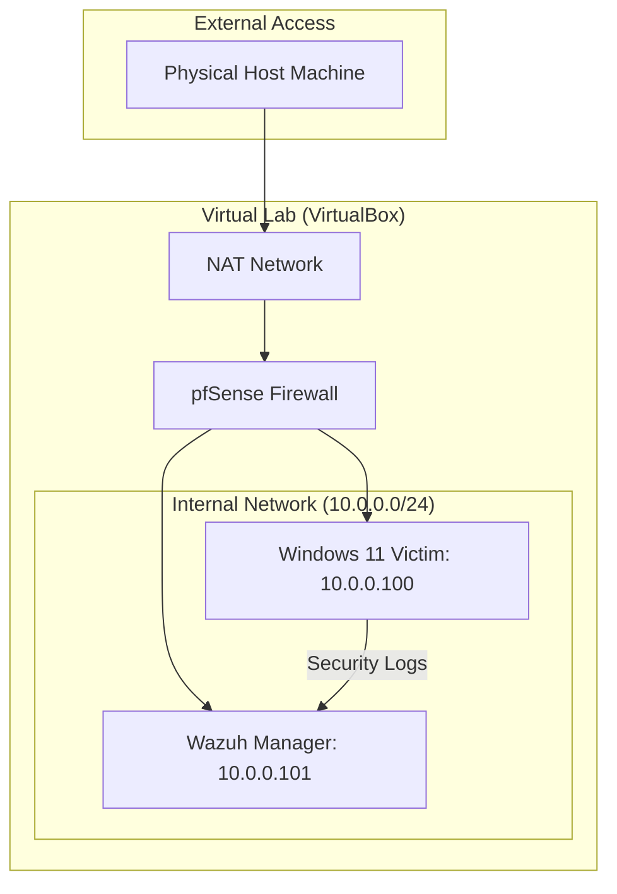

# SOC-Security-Operations-Center-lab

## 📑 Table of Contents
* [1. Project Overview](#1-project-overview)
* [2. Network Architecture](#2-network-architecture)
* [3. Skills & Tools Demonstrated](#3-skills--tools-demonstrated)
* [4. Environment Setup & Troubleshooting](#4-environment-setup--troubleshooting)
* [5. Vulnerability Management & Analysis](#5-vulnerability-management--analysis)
* [6. Incident Response Simulations](#6-incident-response-simulations)
* [7. Lessons Learned & Hardening](#7-lessons-learned--hardening)

---

## 1. Project Overview
This lab simulates a real-world enterprise environment using a **Wazuh SIEM**, a **pfSense firewall**, and a monitored **Windows 11 endpoint**. [cite_start]The goal is to establish a secure monitoring pipeline, identify system vulnerabilities, and simulate real-world attacks to test detection rules.

## 2. Network Architecture
The lab is built within a virtualized network using **VirtualBox**. Traffic is segmented by pfSense to ensure the victim machine is isolated from the host while remaining reachable by the Wazuh manager.

🛠️ 3. Skills & Tools Demonstrated
SIEM/XDR Deployment: Installed and configured Wazuh to monitor endpoints.

Vulnerability Management: Identified over 130 critical/high vulnerabilities on a Windows host.

Log Analysis: Monitored Windows Event Logs, specifically Event ID 4625 for failed logins.

Network Security: Configured pfSense interfaces and firewall rules to segment lab traffic.

🖥️ 4. Environment Setup & Troubleshooting
Active Agent Monitoring
Successfully established a secure connection between the Windows 11 endpoint and the Wazuh Manager.

Case Study: Resolving Agent Connection Issues
I documented an initial configuration error where the agent defaulted to a 0.0.0.0 address. I resolved this by manually editing the ossec.conf file to point to the correct static manager IP (10.0.0.101).

🔍 5. Vulnerability Management & Analysis
Utilizing the Wazuh Vulnerability Detection module, I performed a baseline scan of the Windows 11 host.

Findings: Identified 138 high-priority risks, primarily within Microsoft Teams and OS core packages.

🚨 6. Incident Response Simulations
Simulated brute-force login attempts (Event ID 4625) to verify SIEM alerting. Alerts were successfully triggered and categorized as high-severity events on the Wazuh dashboard.

🛡️ 7. Lessons Learned & Hardening
Privilege Escalation Recovery: Utilized the "Utilman" technique to recover administrative access after an accidental account lockout.

System Hardening: Successfully restored original accessibility files and promoted the standard user to the local Administrators group for permanent, secure access.
