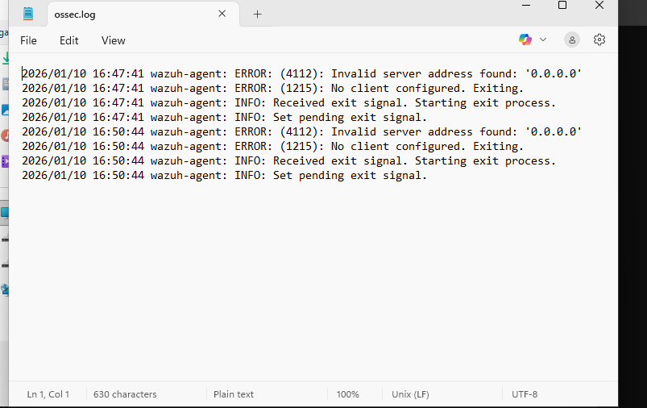
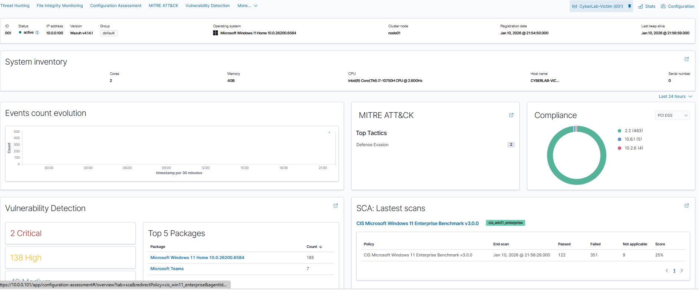

# SOC-Security-Operations-Center-lab

## 📑 Table of Contents
* [1. Project Overview](#1-project-overview)
* [2. Network Architecture](#2-network-architecture)
* [3. Environment Setup & Troubleshooting](#3-environment-setup--troubleshooting)
* [4. Vulnerability Management & Analysis](#4-vulnerability-management--analysis)
* [5. Incident Response Simulations](#5-incident-response-simulations)
* [6. Lessons Learned & Hardening](#6-lessons-learned--hardening)

---

## 1. Project Overview
This lab simulates a real-world enterprise environment using a **Wazuh SIEM**, a **pfSense firewall**, and a monitored **Windows 11 endpoint**. The goal is to establish a secure monitoring pipeline, identify system vulnerabilities, and simulate real-world attacks to test detection rules.

## 2. Network Architecture
The lab is built within a virtualized network using **VirtualBox**. Traffic is segmented by pfSense to ensure the victim machine is isolated from the host while remaining reachable by the Wazuh manager.

![Lab Architecture]
graph TD
    subgraph "External Access"
        Host[Physical Host Machine]
    end

    subgraph "Virtual Lab (VirtualBox)"
        WAN[NAT Network]
        FW[pfSense Firewall]
        
        subgraph "Internal Network (10.0.0.0/24)"
            Wazuh[Wazuh Manager: 10.0.0.101]
            Win[Windows 11 Victim: 10.0.0.100]
        end
    end

    Host --> WAN
    WAN --> FW
    FW --> Wazuh
    FW --> Win
    Win -- "Security Logs" --> Wazuh

## 3. Environment Setup & Troubleshooting
### Active Agent Monitoring
Successfully established a secure connection between the Windows 11 endpoint and the Wazuh Manager.

### Case Study: Resolving Agent Connection Issues
I documented the initial configuration error where the agent defaulted to a '0.0.0.0' address. I resolved this by manually editing the `ossec.conf` file to point to the correct static manager IP (10.0.0.101).

## 4. Vulnerability Management & Analysis
Utilizing the Wazuh Vulnerability Detection module, I performed a baseline scan of the Windows 11 host. 
* **Findings:** Identified 138 high-priority risks, primarily within Microsoft Teams and OS core packages.

## 5. Incident Response Simulations
Simulated brute-force login attempts (Event ID 4625) to verify SIEM alerting. Alerts were successfully triggered and categorized as high-severity events on the Wazuh dashboard.

## 6. Lessons Learned & Hardening
* **Privilege Escalation Recovery:** Utilized the "Utilman" technique to recover administrative access after a lockout.
* **System Hardening:** Restored original accessibility files and secured the built-in Administrator account.
